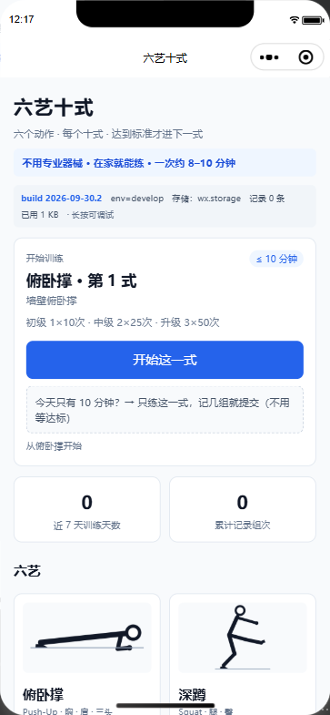
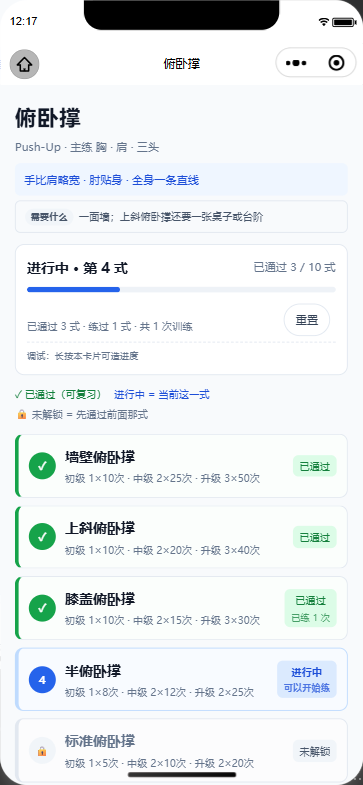
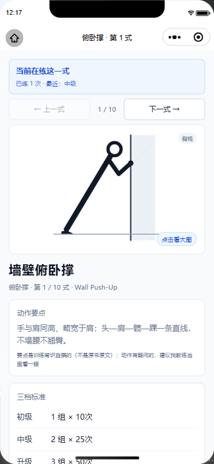
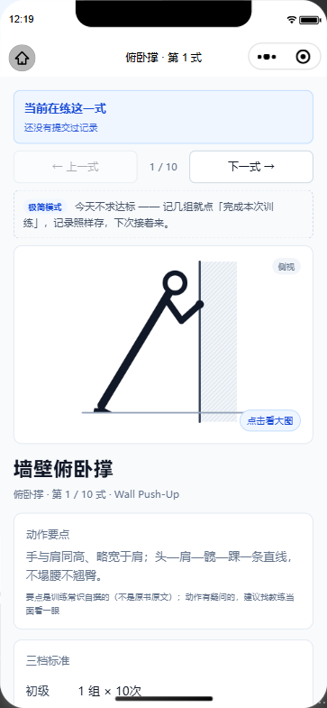
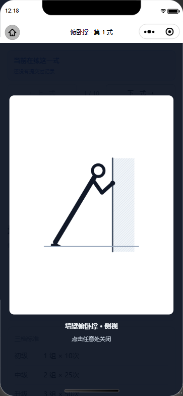
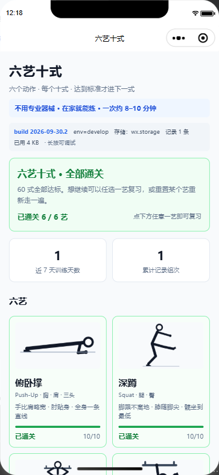

# 六艺十式 · 徒手训练小程序

[](https://github.com/FindSunny/fitness-miniapp/actions/workflows/test.yml)

原生微信小程序（无后端、零网络请求、数据只存本机）。
把"六艺十式"这套阶梯训练法做成**晋级体系**：六个徒手动作 × 每个十式，达到标准才解锁下一式 ——
用户随时知道自己在第几式、离升级还差几组几次。

| | |
|---|---|
| **问题**（桌面调研 + 2 轮用户访谈） | 放弃健身的三条主因：**没人陪着练 / 没时间 / 觉得没器械没场地** |
| **方案**（每条都有对应设计） | 分享卡片 ｜ 极简模式（今天不求达标，记几组也算） ｜ 每艺写明"需要什么"（不吹"零器械"） |
| **推进规则** | **锁定式推进**：只有"已通过的式"和"当前式"能记录，后面的只能看 —— 防跳级、也防状态说不清 |
| **结果** | `npm test` **111** 项自动断言 ｜ `npm run e2e` **102** 条真机断言 ｜ **19** 张截图证据 ｜ 主包 1.3 MB / 2 MB |
| **状态** | 已上传微信后台，等备案通过提审（[上线路径](research/publish-checklist.md) ｜ [提审材料](research/review-submission.md)） |

### 截图（真机截图工具产出，非设计稿）

| 首页 | 十式列表 | 动作详情 |
|---|---|---|
|  |  |  |

| 极简模式 | 点击看大图 | 六艺全通关 |
|---|---|---|
|  |  |  |

> 60 式动作示意图是**自绘参数化线稿**（`tools/vendor/figures/`，每艺一个模块）——
> 不搬运原书插图是版权红线，这条有取舍记录见[已知缺口](#已知缺口诚实清单)第 9 条。

---

## 快速开始

```bash
npm run preview   # ① 生成网页版交互预览（最快看到效果）
npm test          # ② 跑测试（111 项，0 依赖，用 Node 内置测试器）
npm run qr        # ③ 编译 + 出真机预览码（手机扫码就能用）
npm run upload    # ④ 上传开发版（之后去后台「选为体验版」发给别人）
npm run e2e:serve # ⑤ 起自动化服务（跑 E2E 前先执行一次）
npm run e2e       # ⑥ 真机 E2E：102 条断言
npm run e2e:shots # ⑦ 真机 E2E 截图：19 张状态图 + 与视觉基线比对 → e2e/shots/
npm run fix:config      # 配置被工具改坏时，一条命令补回 miniprogramRoot
npm run export:figures  # 重新生成动作图（已生成过）
npm run cards           # 重新生成可打印训练卡 → design/cards/
npm run size      # 看包体积
```

### 测试分层（111 项，`npm test`）

| 层 | 文件 | 数量 | 管什么 |
|---|---|---|---|
| 数据 | `tests/data.test.js` | 17 | 60 式完整性、id 唯一、标准单调、单位/每侧标记、**引用的图片必须存在**、**存疑数据必须写 note**、**禁用医疗表述**、**每式必须有要点且长度/句式合规**、**每艺必须写明器械条件且不许说"零器械"** |
| **数据来源** | `tests/data-source.test.js` | 5 | **60 式标准逐条对齐来源快照**（`tests/fixtures/39net-source.json`）：58/60 一字不差，2 处为**已记录**的修正；「每侧」标记、计时/计次单位也对齐。数据错一个数字，界面上完全看不出来 —— 只有这一层能拦住（核对记录见 `research/data-verification.md`） |
| 逻辑 | `tests/progress.test.js` | 29 | 晋级判定边界（组数够数值不够 / 数值够组数不够 / 超量 / 乱序 / 非法值 / 计时型 / 每侧 / 组数不单调）、**当前式推导**、**解锁判定**、进度换算、首页推荐规则 |
| 存储 | `tests/store.test.js` | 8 | 进度与通关状态、首次/最近通关时间、记录上限、重置语义（含清草稿）、草稿落盘、调试备份/还原 |
| **页面** | `tests/page-flow.test.js` | 47 | **直接驱动真实页面代码**（`tests/helpers/miniapp-stub.js` 给 wx/Page 打桩），覆盖首页推荐、第十式通关流程、复习不回退、列表三态、**锁定不可记录**、**一键档位**、达标后下一式自动进行中、离开再返回、**器械说明透出**、**极简模式（不降标准、不解锁）**、**分享标题与路径**、**详情页文案的语义红线** |
| **界面质量** | `tests/ui-quality.test.js` | 5 | **从真实 WXSS 读色值/字号算 WCAG 对比度**（43 组文字×背景配对）、字号下限、点按区 ≥88rpx、禁用纯黑纯灰、**截图视觉基线（行暗度指纹，容忍重启 IDE 后的 1px 位移）** —— 颜色改浅了、界面被意外改了都会红，见 `ACCEPTANCE.md` 第五节 |

> **为什么要有页面层**：曾有两个 bug 逃过了纯函数单测 —— ①第十式达标后无法通关、进度条卡在 90%；②俯卧撑通关后首页仍推荐它。两个都是"页面把数据拼错了"，不是算法错。加了页面层后，这两条都变成了回归测试（用例名里直接写了"回归：曾经仍推荐俯卧撑第 10 式"）。

> **要给团队讲这套测试方案**：直接打开 `TESTING-REPORT.html`（可视化版，浏览器/手机都能看，支持打印）
> 或 `TESTING-REPORT.md`（同内容的文字版）；细节在 `TESTING.md`。
>
> **只想看一页**：`TESTING-STACK.html`（《测试技术栈 · 一页纸》）——
> 一句话讲清整套流程用了什么技术 + 六层技术清单 + 最小必需三件套，整页约 1.5 屏，适合直接发群/贴文档。
>
> **要把这套做法搬到自己的项目**：打开 `TESTING-METHOD.html`（《小程序测试方法论：从开发主旨到断言设计》）。
> 上半篇讲原则：开发主旨 → 不变量 → 断言（枢纽表）、断言的三种成分（61% 是领域定制）、八条可迁移原则、照搬清单；
> 下半篇讲实现：八层测试、E2E 驱动方式、视觉基线怎么量阈值、测试自己在撒谎的三个坑。
> 三页互链：STACK 是速览，METHOD 讲"怎么设计与迁移"，REPORT 讲"我们具体做了什么"。


### ① 网页预览（推荐先看这个）

打开 `preview/index.html` 就能点着用：首页 → 十式列表 → 详情 → 记一组 → 判定 → 达标弹窗进下一式。

**它不是另写一遍**：`tools/build-preview.mjs` 把小程序的 `data/arts.js` 与 `utils/progress.js` **源码注入页面执行**，所以预览里的判定结果和真机完全一致。

支持深链（方便截图、分享和调状态）：

```
preview/index.html#/                     首页
preview/index.html#/art/pushup           俯卧撑十式
preview/index.html#/art/pushup?at=4      伪造"练到第 4 式"（看列表三种状态）
preview/index.html#/art/pushup?done=1    伪造"已通关"（进度条走满）
preview/index.html#/?complete=pushup     伪造"俯卧撑已通关"（看推荐顺延到深蹲）
preview/index.html#/?complete=pushup,squat,pullup,legraise,bridge,handstand   看六艺全通关态
preview/index.html#/step/pushup/5        标准俯卧撑
preview/index.html#/step/pushup/1?sets=25,25,30   预填记录（看判定结果）
preview/index.html#/step/handstand/1     计时类动作
preview/index.html#/step/pushup/10?sets=5,5,10    最后一式（通关流程）
```

### 首页「继续训练」推荐规则

写在 `utils/progress.js` 的 `recommend()` 里（纯函数，有单测锁住）：

1. **最近练过、且还没通关的艺** → 继续它（真·继续）
2. 否则**按六艺顺序**取第一个没通关的艺 → 通关一个就自动顺延到下一个
3. 六艺全部通关 → 首页显示「全部通关」完成态，提示任选一艺复习

> 这条规则是修 bug 修出来的：最初只按"最近练过的艺"推荐，导致**俯卧撑通关后首页还在推荐俯卧撑第 10 式**。凡是"用户状态驱动的选择"，都值得抽成纯函数 + 单测。

### 训练规则：锁定式推进（R2 访谈后定的）

**只能练"已通过的式"和"当前那一式"；后面的式只能看，不能记。**

| 状态 | 判定 | 能记录吗 |
|---|---|---|
| **已通过**（绿） | 达成过【升级】标准 | 能（复习） |
| **进行中**（蓝） | = **第一个没通过的式** | 能 |
| **未解锁**（灰） | 排在当前式后面 | **不能**（只看动作图和三档标准） |

三条要点：
1. **当前式是推导的**（第一个没通过的式），不是一个存下来的字段 —— 所以**达标那一刻下一式自动变成进行中**，不依赖用户点哪个按钮（访谈里"达标后列表一个进行中都没有"的 bug 就是这么来的）。
2. **达标 = 达成【升级】档（第三档）**，不是"记过一次"。卡在同一式是**设计意图**：产品要做的就是告诉你"还差 3 组 × 50 次"。
3. **六艺之间不锁**：俯卧撑卡住了可以练深蹲（引体向上要单杠，锁死就没法用了）。

> 为什么能跳级是坏事：动作阶梯没走稳就上难度，动作会变形、也容易受伤；
> 而且允许跳级，产品就从"晋级体系"退化成"动作库"了。
> 副作用是好的：状态只有三态，"多个进行中"这种说不清的情况从根上不存在。
> 语义的完整定义在 `ACCEPTANCE.md` 第一节（状态表），改行为前先改那份。

### 一键按标准记录

详情页记录区上方有三个档位按钮（`初级 1×10次` / `中级 2×25次` / `升级 3×50次`）。
点一下 = **按该档标准覆盖当前未提交的组**（不是追加），随即落盘、判定立刻刷新；
手动逐组输入仍然保留。这是 R2 访谈里的头号诉求（"记一组要手输次数，太麻烦"）。


### ② 在微信开发者工具里跑 / 出真机预览码

**先解决 AppID 与目录配置**：

```bash
npm run set-appid -- wx你的16位AppID     # 写入 AppID（或导入弹窗里直接粘贴）
npm run fix:config                       # ⚠️ 必看：补齐 miniprogramRoot
```

> **踩过的坑**：微信开发者工具在导入/改设置时会**重写 `project.config.json`，并丢掉 `miniprogramRoot: "miniprogram/"`**。后果是编译直接报
> `app.json: 在项目根目录未找到 app.json`（代码在 `miniprogram/` 子目录，工具却在根目录找）。
> 任何时候怀疑配置被改坏，跑一次 `npm run fix:config` 即可（只补齐必需字段，保留 appid 与工具写的设置）。

然后：

```bash
npm run qr        # 编译 + 生成真机预览码 → preview/preview-qr.jpg
```

手机微信扫码即可在真机上打开（预览码有时效，过期重跑一次）。比等体验版审核快得多。

**上传开发版 / 做体验版**：

```bash
npm run upload                  # 用 package.json 的版本号
npm run upload -- 0.2.0 "描述"   # 指定版本号与描述
```

上传成功后（会在 mp.weixin.qq.com 的「开发版本」里出现）：
1. 打开 mp.weixin.qq.com → 管理 → 版本管理 → **开发版本**
2. 找到刚上传的版本 → 点「**选为体验版**」
3. 生成体验版二维码 → 发给朋友（对方需先被加为「体验成员」）

> "选为体验版"目前只能在后台网页操作，CLI 没有对应参数。
> `upload` 会先做**上传前自检**（配置、目录结构、appid），避免把编译不了的包传上去。


> 前置条件：开发者工具 → 设置 → 安全设置 → **开启服务端口**（`npm run qr` 依赖它，未开启会超时）。


---

## 目录结构

```
fitness-miniapp/
├─ miniprogram/                 # 小程序本体
│  ├─ app.js / app.json / app.wxss
│  ├─ data/arts.js              # ★ 六艺十式结构化数据（60 式）
│  ├─ utils/progress.js         # ★ 晋级判定（纯函数，可单测）
│  ├─ utils/store.js            # 本地进度与训练记录
│  ├─ pages/index               # 六艺首页（进度概览 + 继续训练）
│  ├─ pages/art                 # 某个艺的十式列表
│  ├─ pages/step                # 动作详情 + 记录 + 判定 + 晋级
│  └─ assets/movements/         # 动作图（PNG，透明底）
├─ assets-src/figures/          # 动作图源文件（SVG，不进小程序包）
├─ design/cards/                # 可打印训练卡（A4 / 方形 / 手机壁纸）
├─ tests/                       # 数据完整性 / 判定逻辑 / 存储 / 页面流程 测试
├─ e2e/                         # 真机自动化：run.js（断言）+ shots.js（截图）
├─ research/                    # R1 桌面调研、R2 访谈提纲/结论、发布清单、提审材料包
├─ preview/                     # npm run preview 生成的网页版预览
└─ tools/                       # 编译 / 上传 / 出码 / 出图 / 出卡 / 体积体检
   └─ vendor/build-cards.mjs    # 训练卡与动作图的绘制源（SVG 生成器）
```

---

## 一、数据层（`miniprogram/data/arts.js`）

60 个动作，一条数据驱动全部页面。字段：

| 字段 | 说明 |
|---|---|
| `id` / `order` | 艺的标识与顺序（pushup / squat / pullup / legraise / bridge / handstand） |
| `name` / `en` / `focus` / `tagline` | 展示用文案（中英名、主练部位、一句话定位） |
| `gear` | **器械条件**（十式列表页顶部「需要什么」那行）。引体要单杠、倒立撑要墙 —— 所以首页只敢写"不用**专业**器械"，不敢写"零器械" |
| `source` | 数据来源链接（可追溯） |
| `steps[].std` | **三档标准**，顺序固定 `[[组数,数值] × 3]` = 初级 / 中级 / 升级 |
| `steps[].cue` | **动作要点**（一句话，18–45 字，句号收尾）。**自撰，不是原书原文** —— 见下 |
| `steps[].unit` | `reps`（次）或 `sec`（秒，倒立撑前三式是静止支撑） |
| `steps[].perSide` | `true` = 每侧计数（偏重/单臂类动作） |
| `steps[].art` / `view` | 示意图文件名与视角（side 侧视 / top 俯视 / front 正视）；`null` = 图待补 |
| `steps[].note` | **数据存疑说明**（不隐藏问题，见下） |

**数据来源与处理原则**
- 标准整理自公开中文资料（[39 健康网整理页](https://fitness.39.net/qtjs/141028/4504262.html)，共 6 页每页一艺），各版本记载略有差异，仅供参照。
- **来源核对已做完，并固化成测试**：把来源抄成快照，60 式标准逐条比对 —— **58/60 一字不差，2 处为有意修正**
  （`tests/data-source.test.js` + `tests/fixtures/39net-source.json`；完整核对记录见 `research/data-verification.md`）：
  - 引体向上第 8 式：来源中级(2×11) 高于升级(2×8)，属明显笔误；**第二来源（原书读书笔记）写作 2×6，与本表一致 → 已核对清楚**，
    用户界面上原来的"存疑备注"已经撤掉（留痕断言在 `tests/data.test.js`）
  - 俯卧撑第 10 式：来源把中级写成 6×10、升级写成 1×100，自相矛盾（两个来源同源抄自同一版，交叉核对解决不了）
    → 按"由易到难 + 每侧"整理为 2×5 / 2×10，**详情页保留了面向用户的说明**（这是有意保留的不确定性）
  - 单臂倒立撑的组数不单调（1×1 / 2×2 / 1×5）→ **来源如此，保留原样**，由判定逻辑正确处理
- 两个来源在个别式上不一致（如二式上斜俯卧撑中级 2×20 vs 2×30）：**统一以 `source` 字段声明的主来源为准**；
  差异清单记在 `research/data-verification.md` 第五节 —— 混用两个来源，只会得到一套没人在用的标准。
- **动作要点（`cue`）是我们自己写的**：只讲通用的发力顺序、幅度、节奏和常见错误（例如"别塌腰""别耸肩""肘贴身"），
  **不抄原书原文、不写医疗表述**，也**不声称是权威教材** —— 详情页"动作要点"下面直接印了这句话。
  写到没把握的式（肩倒立深蹲、偏重引体、半桥这类）时**宁可选保守说法**；**真要练，建议找教练当面看一眼**。
  测试锁的是"**60 式一式不落、18–45 字、句号收尾、不含医疗词**"，锁不了"这句话对不对"——这一条只能靠人看（`ACCEPTANCE.md` 第 30 项）。
- 测试里有一条**禁用词检查**：数据中不得出现「治疗/康复/矫正/疗效/治愈」等医疗表述（扫的是名称 + 要点 + 存疑说明）。

## 二、晋级判定（`miniprogram/utils/progress.js`）

规则：**某档要求"有 N 组都达到 V"**，从高到低检查，达成「升级」即可进下一式。

```js
const { evaluate, gapText } = require('./utils/progress');

evaluate(step, [25, 25])
// → { tier: '中级', canAdvance: false,
//     gap: { tier: '升级', setsNeed: 3, valueNeed: 50, unit: 'reps' } }

gapText(...)  // → "距【升级】还差 3 组 × 50次"
```

这行"还差几组几次"是本产品**最关键的反馈**，所以在测试里锁得最死：达标/不达标边界、组数够数值不够、数值够组数不够、超量完成、乱序记录、非法值、计时型、每侧、组数不单调的标准 —— 共 26 项断言。

## 三、动作图

- 全部**自绘矢量图**（不是书里的插图），源文件在 `assets-src/figures/*.svg`，导出为透明底 PNG 供 `<image>` 使用。
- 已有 **66 张**：**六艺 60 式每式一张**（`mov-<艺>-NN.png`）+ 六艺封面 6 张。
- 俯卧撑十式为什么混用视角：第 6–10 式的差别在**手的位置**（并拢成菱形、一手撑球、单手背后），侧视根本看不出来，所以用俯视图。
- 生成方式：`tools/vendor/figures/<艺>.mjs` 每艺一个模块（参数化线稿），`npm run export:figures` 全量导出；
  单艺预览用 `node tools/vendor/figures/_contact.mjs <艺>` 出一张接触印相图（`%TEMP%\fig-<艺>.png`）。

---

## 架构决策：为什么现在不用云开发

导入项目时的「后端服务」选 **不使用云服务**。这是个刻意决策，不是省事：

| | 不使用云服务（当前） | 微信云开发 |
|---|---|---|
| 数据 | 60 式打进代码包 + 进度存本机 | 云数据库 |
| 成本 | 0 | 有免费额度，超出按量计费（额度以官方为准） |
| 登录 | 不需要（没用 wx.login） | 自带 openid，天然免登录 |
| 服务器域名 | 不需要（零网络请求） | 不需要（云开发免配域名） |
| 隐私合规 | 不收集用户数据，隐私指引压力小 | 需声明收集「训练记录」，审核会看 |
| 开发成本 | 已完成 | 多一套云函数 + 集合 + 冲突合并逻辑 |

**理由**
1. 当前功能（选式 / 记录 / 判定 / 晋级 / 通关）全部是本地逻辑，没有一处需要服务端；
2. "想看多少人在用"用**小程序后台自带的数据分析**即可，不需要自己写埋点后端；
3. 一旦存用户数据，就要配《用户隐私保护指引》并声明数据类型 —— 纯本地没有这个负担。

> 注意：**不论是否用云开发，小程序本身都要备案**。云开发省掉的只是"自有服务器 + 域名备案"。

**什么时候该切（出现任一条就切）**
1. 用户换手机/重装后进度要保留
2. 要做排行榜、好友、打卡互动
3. 60 式内容要能不发版直接更新

**切换成本已被压低**：所有存储访问收敛在 `miniprogram/utils/store.js` 一个文件，页面只调 `isStepPassed / setStepPassed / addSession / completeArt / isCompleted` 这几个方法（**当前式是推导的，不存在"推进"这种写操作**）。切云开发时新增 `store-cloud.js` 实现同一组方法，页面改一行 import。

**想补一个后端展示点**：MVP 上线后做最小闭环 —— 1 个云函数（写进度）+ 1 个集合（进度表）+ 匿名 openid 备份，不碰社交（约 1–2 小时），可讲清服务端数据模型 / 权限规则 / 冲突合并。

### v2 backlog（现在的决定：先不做，等上线后有真实用户数据再定）

| 优先级 | 事项 | 为什么是它 | 依赖 |
|---|---|---|---|
| P0 | **搭子 / 打卡 / 排行榜** | R2 访谈里排第一的放弃原因是"**没人陪着练**"，纯本地无解 —— 这是唯一需要服务端的需求 | 云开发 + 好友关系（需 `wx.getUserProfile` → 隐私指引要改） |
| P1 | **进度云同步**（换手机不丢） | 现在卸载即清空；也是"作品集里缺服务端数据模型"的补位 | 云函数 + 集合 + 冲突合并（同一式两台设备都改过怎么办） |
| P2 | 60 式内容远程更新 | 现在改内容要发版 | 云数据库或 CMS |
| P2 | 自定义训练计划 / 提醒 | 访谈里"没时间"的延伸诉求 | 无服务端也可做（订阅消息要后端） |

> 触发条件写在上面「什么时候该切」里：**任一条命中就切云开发**。在第 3 条（内容要能不发版更新）之外，v2 的 P0 本身就是触发条件。

---

## 版本固化（git）与分支流程

代码托管的最小闭环：**上线/验收的版本 = 一个 commit + 一个 tag**，以后改坏了可以随时回到这一版。

### 三个分支各管什么

```
feature/<topic> ─┐
bug/<topic> ─────┴─→ dev ──(三层验证全绿 + 真机验收)──→ main ──(提审/发布, --no-ff)──→ prod ── tag/<yyMMdd>
```

| 分支 | 定位 | 准入规则 |
|---|---|---|
| **dev** | 日常开发/试验 | 什么都能进，**允许红**（`npm test` 挂了也没关系） |
| **main** | 基线（GitHub 默认分支，**验收包从这里出**） | 只进"`npm test` + `npm run e2e` + `npm run e2e:shots` 全绿 **且** 你真机验收过"的改动，用 `--no-ff` 合并留痕 |
| **prod** | 交付线（**提审包从这里出**） | **只接受从 main 的 `--no-ff` 合并**；每次合并打 `tag/<yyMMdd>`。语义 = **"这一版真机验收通过了"**，提审/发布都用它，不再动历史。<br>（原先写"只放已提审版本"，但提审前会先有几轮验收 —— 照那样 prod 会一直空着；`tag/260929` 当初的含义也是"验收通过的那一版"）<br>**同一天多次交付**加序号：`tag/260930`（v0.1.7）、`tag/260930.2`（v0.1.8）—— 语义不同的版本不互相覆盖 |
| feature/ · bug/ | 大特性 / 线上修复 | 特性从 main 拉；线上 bug 从 prod 拉，修完合 prod 再回灌 main、dev |

**日常怎么走（真实例子：v0.1.6 → v0.1.7）**

```bash
git checkout dev                      # ① 在 dev 上开发
# …改代码 / 跑 npm test…
git commit -am "fix(ui): …"

git checkout main                     # ② 三层验证全绿 + 你真机验收后，合并进 main
git merge --no-ff dev -m "merge: dev -> main（v0.1.7）"
git push origin dev main              # ③ 推送（dev 直推，main 因为带合并提交所以放行）

npm run release:check                 # ④ 发布卫生检查
npm run upload                        # ⑤ 出验收包（来自 main）

git checkout prod                     # ⑥ 验收通过、要提审/发布时，再合并进 prod 并打 tag
git merge --no-ff main -m "release: v0.1.7"
git tag tag/260930 && git push origin prod tag/260930
```

### 三道护栏（防止"手滑直接推线上"）

1. **本地 pre-push 钩子**（`.githooks/pre-push`）：直接往 main/prod 推非合并提交会被**拒绝**，并打印正确做法。每个克隆装一次：
   ```bash
   git config core.hooksPath .githooks      # 这条命令不入库，换机器要重做
   ```
   紧急绕过：`git push --no-verify origin main`（不推荐——出问题只能靠回滚）。
2. **GitHub 规则（公开仓库免费）**：在 `Settings → Rules` 给 main、prod 各建一条 ruleset，勾上
   **Restrict force pushes** + **Prevent deletions**。这两个是"不可逆错误"的防线（误删分支、强推翻掉历史）。
3. **`npm run release:check`**：上传前的卫生检查 —— 工作区干净 / 版本号两处一致 / 分支是 main 或 prod / 没有未推送的提交。
   它已经**挂在 `npm run upload` 前面**（急传测试包可用 `CF_SKIP_RELEASE_CHECK=1` 跳过）。

> **版本号规则**：**每次上传都要 bump patch**（0.1.6 → 0.1.7 → …），`npm run stamp` 负责同步界面上的版本号。
> 这样"版本号"本身就能唯一标识一个包 —— 你在真机上只要看首页底部那行 `v0.1.7` 就知道加载的是哪个包，
> 不用再靠 build stamp 区分"同一版本号的两次上传"。

> **每轮都在同一棵树上重跑三层**，这是这套流程唯一值钱的地方：数字变了就说明"改的东西真的影响了什么"，
> 数字没变却红了就说明"改坏了别的东西"。验收前把这三行报出来，比说"我测过了"有用。
> 历史数字：v0.1.4 = 69 / 63 / 10 ｜ v0.1.5 = 91 / 85 / 13 ｜ v0.1.6 = 101 / 96 / 15 ｜ **v0.1.8 = 111 / 102 / 19**（当前）。

### CI

`.github/workflows/test.yml`：push 到 main/dev/prod 以及任何 PR 时，在 GitHub 上跑一遍 `npm test`（零依赖，秒级）。
**E2E 不进 CI** —— 它要微信开发者工具 + 图形环境，跑不了就别假装绿；E2E 的结论以本地 `npm run e2e` 为准。

不进库的东西（`.gitignore`）：`node_modules/`（依赖）、`.chrome-tmp/`（渲染临时目录）、
`preview/preview-qr.jpg`（含临时 token）、`preview/index.html`（一条命令可再生）、`e2e/shots/`（每次跑都会变）。

## 已知缺口（诚实清单）

| # | 缺口 | 影响 | 计划 |
|---|---|---|---|
| 1 | ~~其余五艺的 45 式没有示意图~~ → **已补齐：六艺 60 式各有自己的示意图**（`mov-<艺>-NN.png`，共 66 张含 6 张封面） | —— | 已完成。做法见 `tools/vendor/figures/`（每艺一个模块，参数化线稿） |
| 2 | ~~其余五艺的 50 式没有技术要点文案~~ → **已补齐：60 式一式不落**（`steps[].cue`，18–45 字一句话）。**但要说清口径**：要点**是我们自己按训练常识写的，不是原书原文，也没找人逐句校对** | 写错的风险由我们自己承担（原书口径更"权威"） | 已交付，见 `ACCEPTANCE.md` 第 30 项。**不猜内容**的旧说法已作废 —— 详见下方"内容与合规红线"第 1 条 |
| 3 | 视觉设计是骨架级 | 不够好看 | R2 访谈没提到视觉，**不优先**（功能与文案先落地） |
| 4 | 无登录/云同步/多端 | 数据只在本机 | MVP 可接受；若上线再加云开发 |
| 5 | **主包体积接近设计上限** | 66 张图 ≈ 1.24MB，主包 ≈ **1.33MB / 2048KB（65%）** | 仍能放下，但这是"每式一张 840×520 PNG"这套做法的天花板。要继续扩内容只有两条路：**降分辨率**（导出时按 2x 出 ~660px，省约 30%）或换成**网络图**（要域名 + 备案）。**分包解决不了**——主包页面不能引用分包里的图 |
| 6 | **"没人陪着练"没有解**（R2 访谈里排第一的放弃原因） | 纯本地做不到真的搭子 | 本轮做了"分享卡片"（压力型），**0 后端**；**好友/打卡/排行榜 = v2 第一需求，走云开发** |
| 7 | ~~② 的"今天只有 10 分钟"入口与分享卡片还没做~~ → **已交付**（首页 `.quick-entry` + 两页 `onShareAppMessage`，见 `ACCEPTANCE.md` 第 32、33 项） | —— | 已完成。真搭子/排行榜仍属第 6 条 |
| 8 | 3 人访谈样本不能当比例 | 结论只能当"案例" | 见 `research/R2-findings.md` §1 的证据强度说明 |
| 9 | 示意图是**参数化线稿**，不是插画级 | 观感朴素；个别式（肩倒立、偏重引体）要靠标注才好认 | 这是**有意的**：不搬运原书插图是版权红线，自绘线稿是当前唯一可行路线；要插画级得真画图或请人画 |
| 10 | **要点文案没人校对**（同第 2 条，单独列出来是因为它和"图能看出来"不一样） | 用户可能照着练错 | 已做三件事兜底：① 只写通用低风险提示（发力顺序/幅度/常见错误）；② 详情页印上"自撰、非原书原文、建议找教练看"；③ 测试禁止医疗表述。**要真解决只有一条路：找教练逐条过一遍** |

## 内容与合规红线（写进代码里的约束）

1. **不搬运原书文字与插图**：书名、作者、书中原文和动作插图都有版权，本项目只用公开的动作名称与标准数据 + 自绘示意图 + **自撰要点**。
   > **口径要说清（v0.1.6 修正）**：动作标准整理自公开中文资料（有 `source` 可追溯）；
   > **60 式要点是我们自己写的短句**，不是原书原文——所以既没有版权问题，**也不该被当成权威教材**。
   > 早先 README 写"要点的内容不猜"，那是在"要点还没写"的前提下说的话；现在要点是自撰的，那句话就不成立了，改成本条。
   > 唯一能真正补上"对不对"的办法是**找教练逐条过一遍**（记在已知缺口 #10）。
2. **不做医疗表述**：定位是"训练记录工具"，文案里不出现治疗/康复/矫正；页面已带免责声明；测试扫描 60 式的名称/要点/存疑说明。
3. **不夸大器械条件**：首页写"不用**专业**器械"，不写"零器械"（引体要单杠、倒立撑要一面墙）；每艺的 `gear` 字段逐条写明需要什么。
4. **AppID 与类目**：类目用「体育 > 在线健身」；`project.config.json` 里的 `touristappid` 必须换成自己的。
