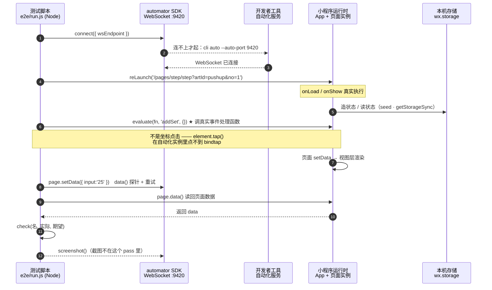

# 小程序自动化测试方案 · 团队分享（初稿）

> 这份复盘的是一个**单人小项目**（微信小程序：六艺十式徒手训练）的测试方案。
> 说"框架"有点大，准确说是**一套分层测试方案 + 一套稳定化后的 E2E 脚手架**，一共 2400 行测试代码。
> 我把它拆开讲，是因为里面有几条经验**跟小程序无关**，后端项目同样适用（见第五节）。

**一句话总结**：用 Node 内置测试器覆盖 111 项逻辑/页面/界面质量断言（0.15 秒、零依赖），
用微信官方自动化 SDK 覆盖 102 条真实运行时断言（1–2 分钟），再加 19 张界面证据图。
**能在低层抓住的问题，绝不留给高层。**

> ⚠️ **先纠正一个术语**：下面表格里的"真机 E2E"是我沿用下来的旧叫法，**不严谨** ——
> `miniprogram-automator` 驱动的是**开发者工具里的模拟运行时**，**不是物理手机**。
> 逻辑层跑的是同一套小程序 JS 运行时（所以状态/存储/导航的结论可信），但**渲染、字体、性能不是真机的**。
> 物理真机只有人工验收（见第四节）。分享时建议直接叫 **"集成 E2E"**，别叫"真机测试"。

---

## 一、技术栈全景

```
第 6 层  真机运行时 E2E ──── miniprogram-automator ──ws──> cli auto --auto-port 9420
第 5 层  编译验证      ──── 微信开发者工具 CLI (cli.bat)  ← PowerShell 封装
第 4 层  页面行为      ──── node:test + 自写 wx/Page 打桩（真实页面代码跑在 Node 里）
第 3 层  存储          ──── node:test + 内存 storage 打桩
第 2 层  纯逻辑        ──── node:test（晋级判定、状态推导、推荐算法）
第 1 层  数据/内容      ──── node:test（60 条动作数据的完整性、合规检查）
```

| 层 | 技术 | 依赖 | 覆盖内容 | 用例/断言 | 耗时 |
|---|---|---|---|---|---|
| L1 数据 | `node:test` + `node:assert` | **无** | 60 条动作数据：id 唯一、标准单调、**引用的图片必须存在**、**存疑数据必须写 note**、**禁用医疗表述**、**60 式要点齐全且句式合规**、**器械条件如实写明** | 17 | ~50ms |
| L2 逻辑 | 同上 | **无** | 达标判定边界、当前式推导、解锁判定、进度换算、首页推荐 | 29 | ~50ms |
| L3 存储 | 同上 + 内存 storage 打桩 | **无** | 进度/通关/草稿落盘/记录上限/重置语义/调试备份还原 | 8 | ~50ms |
| L4 页面 | 同上 + **自写 wx/Page 打桩** | **无** | **直接驱动真实页面代码**：onLoad/onShow/按钮处理函数（含极简模式、分享标题与路径、文案红线、运行环境三态） | 47 | ~80ms |
| L4b 界面质量 | 同上，**从真实 WXSS 读色值/字号** | **无** | WCAG 对比度（43 组配对）、字号下限、点按区 ≥88rpx、禁用纯黑纯灰 | 4 | ~5ms |
| L5 编译 | 微信开发者工具 CLI | — | 真实编译、上传、出预览码、包体积 | — | 30–60s |
| L6 集成 E2E | `miniprogram-automator` **0.12.1** → WebSocket | 1 个 devDep | 真实小程序运行时里的集成断言（**非物理真机**） | **102 条 / 15 场景** | 1–2min |
| L6b 截图 | 同 L6，**独立 pass** | 同上 | 状态证据图（每张互不依赖） | 15 | ~1min |

**总计：111 项 Node 断言 + 102 条 E2E 断言 + 19 张界面证据图。运行环境 Node v24.14.1，运行时依赖 0 个。**

**代码比例**：被测代码 **1383 行 JS**（另有 994 行 WXML/WXSS），测试代码 **2402 行 JS**（≈1.7 : 1）。

```bash
npm test            # L1–L4b：111 项，0 依赖，0.15 秒
npm run e2e:serve   # L6 前置：起自动化服务
npm run e2e         # L6：102 条断言
npm run e2e:shots   # L6b：19 张证据图
npm run qr          # L5：真编译 + 出真机预览码
```

---

## 二、四个技术选型决定（及理由）

### 决定 1：Node 层零依赖，用内置 `node:test`，不引 Jest/Vitest
- 小程序逻辑本来就是 CommonJS 纯函数，`require` 就能测；**没有任何一项需要第三方测试框架**。
- 小项目里"依赖 = 维护成本"：不用配 babel/ts-jest/transform，不会因为某个依赖升级把测试搞挂。
- `node --test` 自动发现 `*.test.js`，`--test --watch` 就是 watch 模式。（Node 18+ 内置）

### 决定 2：必须有"页面层"（L4），不能只测纯函数
**这是被迫加的，代价是两个真实 bug**：
- 第十式达标后**无法通关、进度条卡 90%**
- 俯卧撑通关后**首页仍推荐它**
两个都不是算法错，而是**"页面把数据拼错了"** —— 纯函数单测全绿，页面上就是错的。
做法：写 60 行打桩（`tests/helpers/miniapp-stub.js`），造出 `global.wx` / `global.Page`，
加载真实页面模块 → 拿到 `Page({...})` 的定义 → 造实例 + `setData` → **直接调 `onLoad` / `onShow` / `finish`**。
于是 90% 的页面 bug 被挡在 0.1 秒的测试里，而不是两分钟的 E2E 里。

### 决定 3：真机 E2E 用微信官方 `miniprogram-automator`，不用第三方模拟器
- 官方 SDK 连的是**开发者工具里的小程序真实运行时**（导航、`wx` API、`storage` 全是真的，不是 mock），
  逻辑正确性/状态流转的结论可信。
- 第三方"语法层模拟器"跑得快，但**连运行时都不是同一个**，出了差异你分不清是 bug 还是模拟不准。
- **但它不等于真机**：渲染、字体、性能、跨进程持久性都不覆盖（见第四节）。别把"E2E 全绿"当成"真机没问题"。
- 代价：必须开着开发者工具（下方第三节 3.5 有一堆 Windows 坑）。

### 决定 4：截图和断言拆成**两个 pass**
截图这个环节历史上不稳定过（`page node not found` / `timeout waiting for automator response`）。
所以：**断言 pass 不写图**（稳定，结论以它为准），截图另有 `npm run e2e:shots`，每张图 = 写状态 → reLaunch → 等渲染 → 截图，**互相独立**，一张失败不影响别的。
**原则：不让一个不稳定的环节影响结论的可信度。**

---

## 三、实践经验（最值得抄的部分）

### 3. 断言要写"用户看得见什么"，不是"我的实现返回了什么" ⭐

这是**最大的教训**。项目里归档了 **29 个真实 bug，其中 25 个是用户发现的**（真机验收 + 用户访谈）；
而我自查发现的那几个，基本都是"**工具/文案**"类（编译配置、通关里程碑时间、解锁提示里的数字）。
**用户发现的几乎全在"我看到什么"这一层，我漏掉的也几乎全在那一层。**

一个最能说明问题的例子：R2 用户访谈那一轮，用户当场带出 **3 个可用性 bug**
（"记了一组列表没反应"、"达标后列表里没有进行中"、"记一组要手输次数太麻烦"），
**而当时我的 91 项 Node 测试 + 85 条 E2E 断言是全绿的** —— 因为它们全都在验证"实现是否按我设想的方式工作"。

原因很直白：我早期写的断言长这样 ——

```js
// ❌ 反面：照着当时的实现写，等于用实现给自己打分
assert.strictEqual(page.data.steps[1].stateText, '未开始');
```

而用户看到的问题是："我记了一组，列表上**什么都没变**"。
改成按**用户语义**断言之后，同一类 bug 立刻暴露：

```js
// ✅ 正面：断言用户看得见的那句话，以及里面每个数字
assert.strictEqual(steps[0].stateText, '进行中');
assert.strictEqual(steps[0].stateSub, '已练 1 次 · 最近：中级');   // 练过就必须看得出来
assert.match(lockHint, /达标标准【升级】3 组 × 50次/);          // 数字也要断言，别只断言"有这句话"
```

> 最后那条是我**看截图**才发现的：提示文案写的是"距【初级】还差 1 组"，但真正的过关门槛是【升级】3 组 × 50 次。
> **断言太宽，就等于没断言** —— 只断言"提示里提到了第 1 式"，就漏掉了"里面那个数字是错的"。

### 3. 必须测"往返"：操作 → 离开 → 回来

好几个 bug（记录丢失、历史看不见、状态不跟随）都发生在**离开页面再回来**这条缝里，
而当时的 E2E 全程在同一个页面实例上操作、只断言 `storage` 里有数据 —— 于是"存对了但界面上没有"这类问题全漏了。
现在每个关键流程都有往返用例：**回到界面上，必须看得见结果**。

### 3. 测试自己会撒谎（元级质量）⭐⭐

这一轮我踩到三个，比 App 的 bug 更危险，因为它们会让**后面所有结论都不可信**：

**坑 A：场景崩了，却报"全部通过"**
一次 `page node not found` 让整轮只跑了前 3 个场景，输出却是
`E2E：19 / 19 通过`、**退出码 0**。
原因：场景异常被外层 `try/catch` 吞掉，只打印不计数，而"通过率"只统计 `check()`。
修法两条：
1. 崩溃时 `check('场景「X」执行完成', false, err)` **记一条失败**；
2. 加一个 `EXPECTED_CHECKS = 102`，**实际条数对不上就报警 + exit 1**。
   （代价：每次增删断言要改这个常量。值得 —— 这是唯一能发现"测试没跑完"的办法。）

**坑 B：空截图算成功**
我试着在截图前滚页面，截出一张 10KB 的**白板**，脚本照样报 `✓ 12/12`。
修法：加体积下限（> 15KB 才算成功；正常图 45–62KB）。

**坑 C：断言全绿，东西却是坏的 / 话是错的**
全屏大图那次的断言只证明"遮罩在、图片渲染了"，**截图一看：黑色线稿放在深色遮罩上几乎看不见**。
更隐蔽的一次：极简模式的提示写"进度照样算"，而**没达标的提交并不会推进晋级进度** —— 话是错的，测试照样绿。
修法：① 把"人看图"写进流程（B 组人工检查单，改 UI 的轮次必过）；
② 文案本身也按语义写断言，**含糊的话不给过**。
**能算出来的交给脚本，读不读得懂只能靠人。**

> **通用原则：凡是"产物存在即成功"的断言，都等于没断言。**
> 对测试工具自己的输出，也要做有效性断言。

### 3. flaky 的处理原则

1. **不稳定层不得影响结论**（见决定 4）。
2. **"失败点固定"和"失败点随机"是两类问题**：
   本轮 E2E 连续两次挂在**同一个**场景（`page node not found`）→ 我判断不是 flake，是**环境状态退化**（开发者工具会话开了太久）→ 重启项目窗口即恢复，随后 102/102。
   *失败点固定 = 环境状态问题；失败点随机 = 时序竞争。*
3. **不要用"重跑一次就过了"糊过去** —— 那是在训练自己忽略红灯。

### 3.5 架构时序图：一次场景到底发生了什么



**看三件事就够了**：
1. `reLaunch` / `evaluate` / `page.data()` 全都是**真实导航、真实处理函数、真实页面数据**（不是 mock）；
2. 「小程序运行时」是唯一真的在跑小程序的地方 —— 所以状态/存储/导航的结论可信，但**渲染不是真机的**；
3. 虚线的都是**可选或补偿路径**（服务没起才拉起来、探针重试、截图分开跑）—— 稳定的部分与易抖的部分在架构上就是分开的。

### 3.6 平台/工具坑清单（可直接抄，Windows + 微信开发者工具）

| 坑 | 现象 | 对策 |
|---|---|---|
| `element.tap()` | 在自动化实例里点不到 `bindtap`（试过多轮） | 改用 `mp.evaluate` + `getCurrentPages()` **调真实处理函数**（代码路径一样，只是不经过手指坐标） |
| `page.callMethod()` | 报 `this.goArt is not a function` | 同上绕过 |
| `mp.evaluate` 里写 `setData` | `timeout waiting for automator response` | 用 SDK 的 `page.setData()`，且每次重新取栈顶页面 |
| `mockWxMethod` 传函数 | 函数被序列化到 App 侧执行，**拿不到 Node 侧局部变量** | 用对象形式 `{confirm:true}`；弹窗文案改在 L4 断言（那里有打桩） |
| 页面跳转时序 | `reLaunch` 后固定 `sleep(900)` 不够，偶发 `page node not found` | `data()` 做**探针** + 重试；先 `waitForPage` 再操作 |
| Windows 路径 | `spawnSync(cli, args, {shell:true})` 在 `Program Files (x86)` 下把 `--project` 参数传坏（报 `code 19`） | 改走 PowerShell 调用（`& "路径" args...`） |
| PowerShell 写文件 | 带 UTF-8 BOM → `JSON.parse` 失败 | 读的时候 `.replace(/^\uFEFF/,'')`，写的时候显式 `UTF8Encoding($false)` |
| 跑 E2E 时改项目文件 | 开发者工具重编译 → App 重启 → 页面栈清空，测试随机失败 | `compileHotReLoad: false` + 每个场景自己 `reLaunch` 复位 + **跑之前别动文件** |
| 截图前滚页面 | `page.scrollTop()` 只对 `scroll-view` 有效；`wx.pageScrollTo` 会把页面滚成空白 | 放弃滚屏；**详情页下半部分的视觉证据交给人工验收** |

### 3.7 把"业务规则"也写进测试（不只是代码正确性）

数据层那 17 条断言里，有几条是**业务/合规规则**，比代码规范更硬：
- **引用的图片必须真实存在**（防止"数据写了图、文件没提交"）
- **存疑数据必须写 `note`**（源数据有 3 处自相矛盾，不允许静默修改 —— 修正了就要标注）
- **禁用医疗表述**（训练工具不能出现"治疗/康复/矫正/疗效"，合规红线）
- **60 式要点必须一式不落、18–45 字、句号收尾**（自撰文案也要有格式约束，否则"补齐了"就是一句空话）
- **器械条件必须如实写明，且不许写"零器械"**（引体要单杠、倒立撑要墙 —— 夸张的宣传语最容易被自己漏过去）
- **版本号两处必须一致**（真踩过：`package.json` 是 0.1.4、界面记录里是 0.1.0，排查了半天"我跑的是哪版"）

### 3.8 验收清单驱动补测试
拿一份**可验证的验收清单**（操作 + 预期现象，16 → 23 → 34 项）逐条对照自动化覆盖，缺的补测试。
> **先有验收清单，再回头补测试**，比"照着实现写测试"少很多洞。
> 反过来也成立：清单里那些**只能靠人**的项（跨进程持久性、字体/颜色/一眼能不能懂、**要点写得对不对**）要在文档里明确标出来，不要假装自动化覆盖了。

---

## 四、诚实边界：这套东西覆盖不了什么

| 覆盖不了 | 为什么 | 谁来做 |
|---|---|---|
| 真机手感、性能、滚动流畅度 | 自动化跑在开发者工具的模拟运行时里 | 人工 |
| **跨进程持久性**（退出小程序再进数据还在吗） | 环境行为，模拟器里造不出来 | **只能真机验收** |
| "好不好看 / 一眼能不能懂" | 审美与理解力 | 人工 |
| 图片在真机上的加载速度 | 同上 | 人工 |
| **动作要点写得对不对** | 只能验"一式不落、句式合规、没有医疗词"，验不了"这句话对不对" | **人工 + 找教练过一遍** |
| 分享面板弹出来长什么样 | 那是微信原生 UI，只能验我们返回的标题与路径 | 人工 |
| 没有 CI、没有覆盖率统计、没有视觉回归 | 单人项目没做 | 若要：见下节 |

**真机验收清单里，我明确标了"只有人能验"的项**（比如"第 2 式是不是一眼就看出是进行中"），
不把它们混进自动化通过率里充数。

---

## 五、如果团队要照搬：按投入从低到高

| 优先级 | 做什么 | 投入 | 收益 |
|---|---|---|---|
| **P0** | **把业务逻辑抽成纯函数 + `node:test`** | 1 天 | 最大。快、稳、零依赖，覆盖 80% 的判断类 bug |
| **P1** | **断言改成"用户/调用方看得见什么"** | 0（改写法） | 把"自己给自己打分"的假绿变成真绿 |
| P1 | **补"往返"用例** | 半天 | 专抓"存对了但没显示"这一类 |
| P2 | **界面/页面层打桩**（或前端的组件测试） | 半天–1 天 | 抓"把数据拼错了" |
| P2 | **E2E 稳定化三件套** | 1 天 | ① 调真实处理函数而非坐标点击 ② 探针 + 重试 ③ **期望条数常量** |
| P3 | **验收清单驱动补测试** | 半天 | 让测试和"用户会验什么"对齐 |
| P3 | CI（把 Node 层 + 编译放进流水线；E2E 需要图形环境，酌情） | 1–2 天 | 防回归 |

**三句可以直接写进汇报的话**：
1. **能在低层抓住的问题不要留到高层** —— 同样一条断言，Node 层 1 毫秒，E2E 层 2 分钟，差 5 个数量级。
2. **测试的价值取决于断言的"视角"** —— 用实现的视角写，只能证明代码和昨天一样；用用户的视角写，才能发现"看起来没坏但就是不对"。
3. **先怀疑测试，再怀疑代码** —— 崩溃报通过、空图算成功、断言全绿但东西是坏的，
   这三类"测试在撒谎"的问题比业务 bug 更危险，
   要给测试自己的输出也加断言（条数校验、产物有效性校验），并保留一道**人工看图**的关口。
